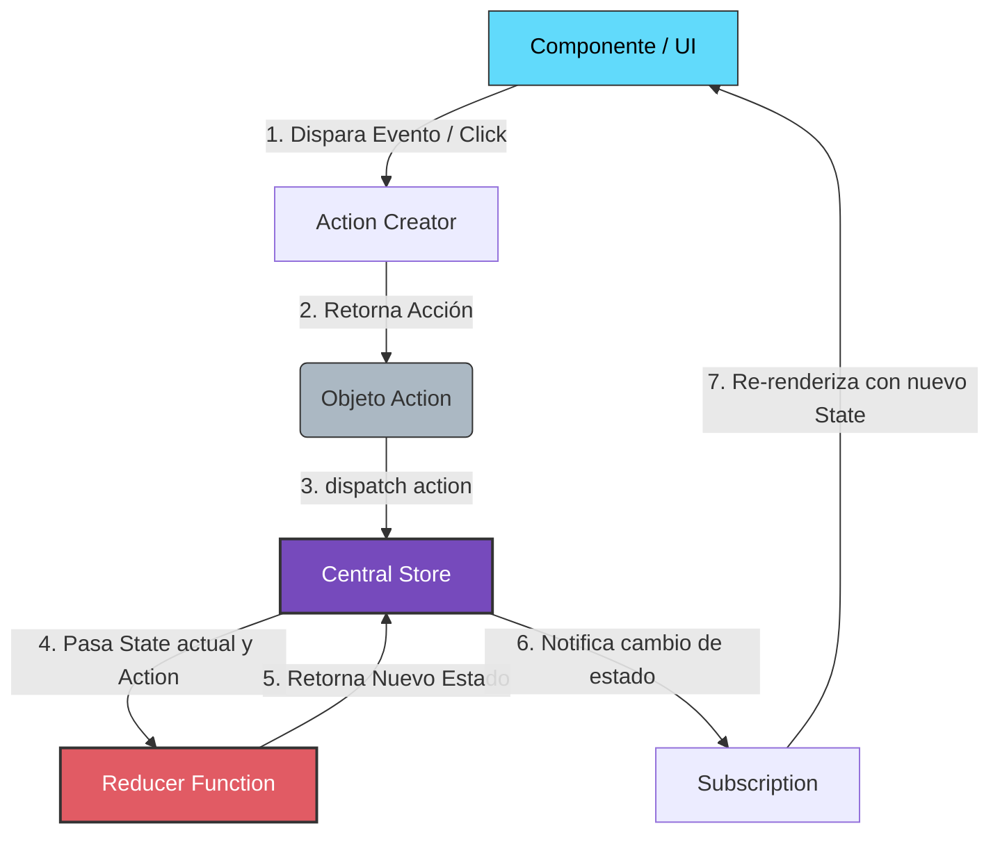

# Redux (Clásico)

**Redux** es una biblioteca para la gestión del estado global de aplicaciones JavaScript. Sigue una arquitectura inspirada en **Flux** y la programación funcional, permitiendo que el estado de la aplicación sea predecible y fácil de depurar.

---

## Principios Fundamentales de Redux

1. **Única fuente de la verdad:** Todo el estado de la aplicación se almacena en un único árbol de objetos dentro de un único **Store**.
2. **El estado es de solo lectura:** La única forma de modificar el estado es emitiendo (dispatch) una **Action** (un objeto que describe qué sucedió).
3. **Los cambios se realizan con funciones puras:** Para especificar cómo el árbol de estado se transforma a partir de las acciones, se escriben **Reducers** puros.

---

## Componentes Principales y Conceptos

### 1. Store
Es el objeto central que mantiene el estado de toda la aplicación. Solo debe existir un Store en una aplicación Redux.
* **Responsabilidades:**
  * Almacenar el estado.
  * Permitir el acceso al estado mediante `getState()`.
  * Permitir que el estado se actualice mediante `dispatch(action)`.
  * Registrar oyentes (listeners) mediante `subscribe(listener)`.

### 2. Actions (Acciones)
Son objetos planos de JavaScript que representan una intención de cambiar el estado. Son la única fuente de información para el Store.
* **Regla:** Deben tener una propiedad `type` (generalmente un string constante) que indique el tipo de acción. Opcionalmente pueden llevar un `payload` con datos.
* **Action Creators:** Funciones que retornan un objeto de acción.

```javascript
// Objeto de Acción
const agregarTodoAction = {
  type: 'todos/agregar',
  payload: 'Aprender Redux Saga'
};

// Action Creator
const agregarTodo = (texto) => ({
  type: 'todos/agregar',
  payload: texto
});
```

### 3. Reducers
Son funciones puras que toman el estado actual y una acción, y retornan un **nuevo** estado.
* **Regla de Oro:** **Nunca** debes modificar (mutar) el estado directamente dentro de un reducer. Debes retornar un nuevo objeto (inmutabilidad).
* **Fórmula:** `(state, action) => newState`

```javascript
const initialState = { todos: [] };

function todosReducer(state = initialState, action) {
  switch (action.type) {
    case 'todos/agregar':
      // Retorna una copia del estado con el nuevo elemento (Inmutabilidad)
      return {
        ...state,
        todos: [...state.todos, action.payload]
      };
    default:
      return state;
  }
}
```

### 4. Subscriptions (Suscripciones)
Es el mecanismo mediante el cual los componentes o partes de la aplicación escuchan los cambios en el Store. Cuando el estado cambia, el Store notifica a todos los suscriptores para que actualicen su interfaz de usuario.

```javascript
// Suscribirse a los cambios
const unsubscribe = store.subscribe(() => {
  console.log('El estado ha cambiado:', store.getState());
});

// Para cancelar la suscripción
unsubscribe();
```

---

## Flujo de Datos Unidireccional (Unidirectional Data Flow)

Redux impone un flujo de datos estricto y unidireccional. Esto significa que los datos siguen el mismo camino en un ciclo cerrado:



---

## Manejo de Asincronía en Redux

Por definición, los **Reducers** son funciones puras: no pueden realizar efectos secundarios (como llamadas a APIs, temporizadores o mutaciones externas). Toda la lógica asíncrona debe ocurrir fuera del flujo síncrono estándar, utilizando **Middleware**.

Los dos middlewares más populares para gestionar efectos secundarios y asincronía en Redux clásico son **Redux Thunk** y **Redux Saga**.

### Redux Thunk
Es el middleware oficial por defecto. Permite escribir **Action Creators** que retornan una **función** en lugar de un objeto de acción. Esta función interna recibe los métodos `dispatch` y `getState` del Store.

* **Ventajas:** Simple de entender y rápido de implementar. Ideal para peticiones HTTP sencillas.
* **Ejemplo:**
```javascript
// Action Creator asíncrono (Thunk)
const fetchUsuario = (id) => {
  return async (dispatch, getState) => {
    dispatch({ type: 'usuario/loading' });
    try {
      const response = await fetch(`https://api.ejemplo.com/usuarios/${id}`);
      const data = await response.json();
      dispatch({ type: 'usuario/success', payload: data });
    } catch (error) {
      dispatch({ type: 'usuario/error', payload: error.message });
    }
  };
};
```

---

### Redux Saga
Es un middleware que utiliza las **Funciones Generadoras** de ES6 (`function*`) para hacer que los efectos secundarios sean más fáciles de leer, escribir y probar. Utiliza conceptos de la Programación Reactiva y permite gestionar flujos asíncronos complejos.

* **Ventajas:** Excelente para flujos complejos (cancelación de peticiones, reintentos, concurrencia, WebSockets). Facilidad extrema para pruebas unitarias sin necesidad de mocks complejos.
* **Ejemplo:**
```javascript
import { call, put, takeEvery } from 'redux-saga/effects';

// 1. Trabajador (Worker Saga): Realiza la tarea asíncrona
function* fetchUsuarioSaga(action) {
  try {
    const response = yield call(fetch, `https://api.ejemplo.com/usuarios/${action.payload}`);
    const data = yield response.json();
    // 'put' es el equivalente a dispatch() dentro de las Sagas
    yield put({ type: 'usuario/success', payload: data });
  } catch (error) {
    yield put({ type: 'usuario/error', payload: error.message });
  }
}

// 2. Observador (Watcher Saga): Escucha las acciones y ejecuta el trabajador
function* rootSaga() {
  yield takeEvery('usuario/request', fetchUsuarioSaga);
}
```

---

### Comparación: Thunk vs. Saga

| Característica | Redux Thunk | Redux Saga |
| :--- | :--- | :--- |
| **Complejidad** | Baja. Utiliza promesas y async/await normales. | Alta. Requiere dominar generadores de JS (`yield`) y efectos de la librería. |
| **Control de Flujo** | Limitado. Difícil de cancelar o gestionar colisiones de solicitudes. | Total. Permite cancelar tareas, usar estrategias como `takeLatest` (ignorar clics rápidos repetidos), etc. |
| **Facilidad de Testeo** | Media. Requiere mockear llamadas de red directamente. | Muy alta. Las sagas devuelven objetos de instrucción fáciles de comparar en pruebas unitarias. |
| **Boilerplate** | Mínimo. | Alto (creación de watchers, workers y configuración adicional). |
